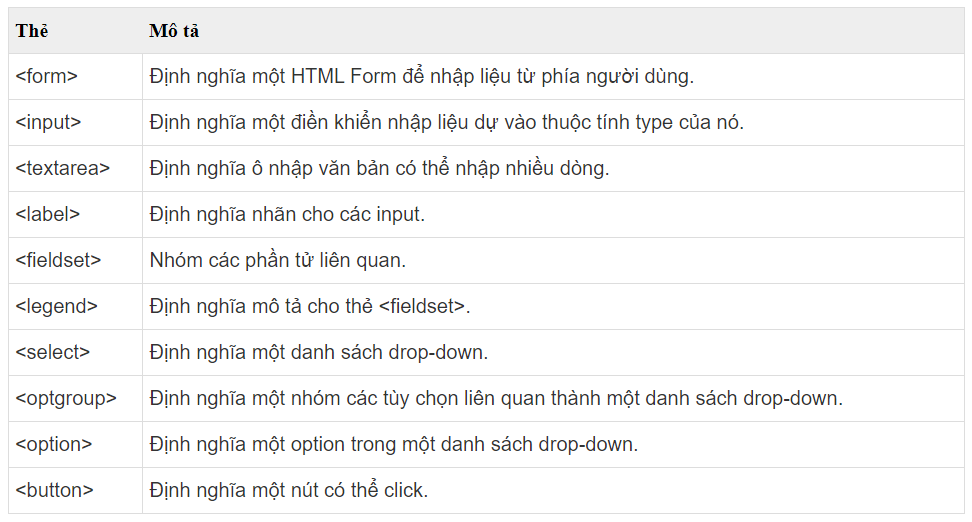

#BUỔI 1: NHẬP MÔN WEB: CÁC KIẾN THỨC CƠ BẢN VỀ HTML.
Có thể các bạn biết rằng câu hỏi  phổ biến mà các bạn có thể gặp khi đi phỏng vấn vị trí Web developer "Có 1 trình duyệt web, giả sử bạn gõ Google.com , chuyện gì sẽ xảy ra từ lúc bạn bấm enter cho tới khi hiện được lên trang Google?". Để trả lời câu hỏi này, hãy cùng tìm hiểu về phần đầu tiên của bài học.
####I. Cách thức hoạt động của một trang web

    **Website là gì?**
    **Website** còn gọi là trang web hoặc trang mạng, là một tập hợp trang thông tin có chứa các dạng hình ảnh, văn bản, video, audio..được lưu trữ trên web sever (máy chủ) và người dùng có thể truy cập từ xa thông qua internet.
    Cách thức hoạt động của một trang web
    Như ở ví dụ trên , khi các bạn gõ Google.com , máy tính của bạn sẽ đọc từ file host để xem domain này tương ứng với IP nào, nếu không có thì tiếp tục tìm kiếm tới DNS, DNS sẽ dịch địa chỉ Google.com thành 1 địa chỉ IP ,giả sử IP có dạng là 64.233.160.0 .Chúng ta thấy rằng địa chỉ IP này rất khó nhớ, đặc biệt khi mà bạn sử dụng nhiều địa chỉ, bạn sẽ phải tốn thời gian và sức lực để nhớ rất nhiều. 
    Ở trang google , ta gọi đó là 1 server , còn mình là client,khi mà client đã biết địa chỉ IP là  64.233.160.0, client sẽ thực hiện kết nối với server thông qua giao thức TCP thông qua việc bắt tay 3 bước (đầu tiên client sẽ gửi cờ syn , server gửi lại 1 tín hiệu syn-ack , và cuối cùng client gửi lại server cờ ack và thành công trong việc kết nối giữa client và server).Sau đó Browser sẽ nói chuyện với Server thông qua giao thức HTTP (HTTP là giao thức thuộc tầng ứng dụng , TCP là giao thức thuộc tầng giao vận tầng dưới của tầng ứng dụng và tầng trên thì có thể sử dụng chức năng tầng dưới nên HTTP đã dựa vào TCP để truyền dữ liệu ) .Ví dụ Browser sẽ truyền HTTP với phương thức GET và URL https://www.google.com/ ,HTTP sẽ gọi port 80 trên server, trên server sẽ trả lại HTML để browser có thể hiển thị.
    **Tóm lại**, khi gõ 1 URL vào trình duyệt , URL sẽ chuyển tới DNS và DNS chuyển URL đó thành địa chỉ IP.Khi biết được địa chỉ IP ta sẽ kết nối tới server tương ứng theo giao thức TCP, browser sẽ gửi 1 request GET và lấy được HTML về và hiển thị.
####II. Cấu trúc của HTML
**1, Khái niệm**
HTML (tiếng Anh, viết tắt cho HyperText Markup Language, hay là "Ngôn ngữ Đánh dấu Siêu văn bản") là một ngôn ngữ đánh dấu được thiết kế ra để tạo nên các trang web với các mẩu thông tin được trình bày trên World Wide Web.
**2, Cấu trúc HTML**
    
Cấu trúc cơ bản của trang HTML có dạng như sau, thường gồm 3 phần:
    <!Doctype>: Phần khai báo chuẩn của html hay xhtml.
    < head>...< /head>: Phần khai báo ban đầu, khai báo về meta, title, css, javascript…
    < body>...< /body>: Phần chứa nội dung của trang web, nơi hiển thị nội dung.

####III.  Thẻ Block và thẻ inline. Phân biệt div, span.
**1, Thẻ block và thẻ inline**
    Block và Inline là hai khái niệm cơ bản nhưng rất quan trọng khi bạn bắt tay vào thiết kế website. Hầu hết các thành phần trong HTML đều thuộc block hoặc inline. Vậy block là gì? Inline là gì?
    **Block** là những thẻ tự động tạo một dòng mới ở đầu và ở cuối của thẻ khi hiển thị trên trình duyệt. Ví dụ như thẻ: < h1>, < p>, < ul>, < table>
Ví dụ:
```html
Thành phần 1 <p>thành phần 2</p> thành phần 3
```
Trình duyệt sẽ hiển thị:
```html
Thành phần 1
thành phần 2
thành phần 3
```

**Inline** là những thẻ hiển nội dung trên cùng một dòng (không tạo ra dòng mới, không xuống dòng).Như thẻ: < b>, < td>, < a>,< img>
Ví dụ:
```html
Thành phần 1 <span> thành phần 2</span> thành phần 3
```
Trình duyệt sẽ hiển thị:
```html
Thành phần 1 thành phần 2 thành phần 3
```

**2, Phân biệt div, span**
**a) Thẻ div trong HTML**
Thẻ < div> là một thẻ block có thể sử dụng để chứa các thành phần HTML khác.
Thẻ < div> không mang ý nghĩa đặc biệt nào (như thẻ < h1> dùng để định nghĩa đề mục, thẻ < a> để tạo liên kết…) và cũng không kèm theo thuộc tính bắt buộc.
Vì là một thẻ block nên khi hiển thị, trình duyệt sẽ thêm một dòng ở trước và sau thẻ.
    
**b) Thẻ span trong HTML**

Thẻ < span> trong HTML là một thẻ inline có thể sử dụng để chứa nội dung là chữ.
Cũng giống thẻ < div>, thẻ < span> không mang ý nghĩa đặc biệt nào và cũng không có thuộc tính bắt buộc.
Nếu như thẻ < div> được tự động thêm dòng mới ở đầu và cuối thì thẻ < span> lại hoàn toàn không có bất kỳ trang trí tự động nào.

**c) Phân biệt div và span**
Ví dụ:

Kết quả:


    ***Nhận xét**
    +Về độ cao : cả 2 thẻ đều có độ rộng bằng nội dung mà nó chứa
    +Về độ rộng: .div : độ rộng bằng chính màn hình, trình duyệt => kiểu thẻ block
                .span : độ rộng bằng chính nội dung mà nó chứa  => kiểu thẻ inline
    =>Kiểu thẻ block và kiểu thẻ inline luôn có độ rộng bằng nội dung mà nó đang chứa
    **So sánh giữa thẻ div và span trong Html:**
|               | Thẻ div                                     | Thẻ span                                   |
| ------------- | ------------------------------------------- | ------------------------------------------ |
| Loại phần tử  | Phần tử cấp khối                            | Yếu tố nội tuyết                           |
| Bắt đầu       | Trên một trang mới                          | Không cần phải bắt đầu trên một dòng mới   |
| Không gian    | Chiếm hết chiều rộng có sẵn                 | Chiếm càng nhiều chiều rộng càng cần thiết |
| Được dùng như | Một thùng chứa cho các thành phần HTML khác | Một thùng chứa cho một số văn bản          |

####IV. Các thẻ liên quan đến table trong HTML
**1. Thẻ table trong HTML là gì?**
    Thẻ table trong HTML được sử dụng để hiển thị dữ liệu ở dạng bảng (hàng * cột). Có thể có nhiều cột trong một hàng.
    Các thẻ table trong HTML được sử dụng để quản lý việc bố cục trang web. Ví dụ: Phần tiêu đề, thanh điều hướng, nội dung trang, phần chân trang... Nhưng bạn nên sử dụng thẻ div thay vì table để quản lý bố cục của trang.

**a) Các thẻ định nghĩa bảng trong HTML**

**b) Cách tạo table**
Để tạo table một cách đơn giản nhất để tạo table là tuân theo cú pháp sau:

**Trong đó:**
    Thuộc tính border="1" là khai báo đường viền của table
    Thuộc tính cellspacing="0" là khai báo khoảng cách giữa viền trên và viền dưới của đường viền
    Thuộc tính cellpadding="5" là khai báo khoảng cách giữa nội dung trong ô so với đường viền
    Nếu muốn thêm một cột thì chỉ việc bổ sung một td
    Nếu muốn thêm một hàng thì chỉ việc bổ sung một tr

**Kết quả:**


**2. Colspan trong HTML**
    Colspan html là một thuộc tính của thẻ table, nó được dùng để trộn các ô lại với nhau trên cùng một hàng. Ví dụ bạn muốn trộn 2 ô với nhau thì khai báo giá trị cho nó là 2, trộn 3 ô thì khai báo là 3.

Khi khai báo colspan thì số lượng thẻ td của hàng hiện tại sẽ được giảm đi so với các hàng khác.
Như trong ví dụ dưới đây thì thẻ tr đầu tiên chỉ có hai thẻ td, còn thẻ tr thứ hai thì có đến 3 thẻ td. Lý do là trong thẻ tr đầu tiên có một thẻ td có colspan = 2.
Ví dụ:
```html
    <table border="1" cellspacing="0" cellpadding="5">
        <tr>
            <td colspan="2">Hàng 1 cột 1 và Hàng 1 cột 2</td>
            <td>Hàng 1 cột 3</td>
        </tr>
        <tr>
            <td>Hàng 2 cột 1</td>
            <td>Hàng 2 cột 2</td>
            <td>Hàng 2 cột 3</td>
        </tr>
    </table>
```
Kết quả:


**3. Rowspan trong HTML**
Tương tự như colspan, rowspan được dùng để gộm hai ô lại với nhau. Tuy nhiên, nó sẽ gộp theo cột chứ không phải theo hàng. Bạn muốn gộp bao nhiêu ô thì hãy nhập số lượng cho nó. 
Ví dụ:
```html
    <table border="1" cellspacing="0" cellpadding="5">
        <tr>
            <td rowspan="2">Hàng 1 cột 1</td>
            <td>Hàng 1 cột 3</td>
            <td>Hàng 1 cột 3</td>
        </tr>
        <tr>
            <td>Hàng 2 cột 2</td>
            <td>Hàng 2 cột 3</td>
        </tr>
    </table>
```

Kết quả:


**4. Nhóm thẻ thead - tbody - tfoot**
    Người ta sẽ chia table ra làm ba thành phần chính, đó là header, body và footer tương ứng với các thẻ thead, tbody và tfoot.
    Ví dụ: Xây dựng cấu trúc table cho form trên.
```html
     <table border="1" cellspacing="0" cellpadding="5">
        <thead>
            <tr>
                <td>
                    Username
                </td>
                <td>
                    Email
                </td>
            </tr>
        </thead>
        <tbody>
            <tr>
                <td>
                    TheHalfheart
                </td>
                <td>
                    TheHalfHeart@gmail.com
                </td>
            </tr>
            <tr>
                <td>
                    Freetuts
                </td>
                <td>
                    Freetuts.net@gmail.com
                </td>
            </tr>
        </tbody>
        <tfoot>
            <tr>
                <td>
                    Username
                </td>
                <td>
                    Email
                </td>
            </tr>
        </tfoot>
    </table>
```
Kết quả:


####V. Các thẻ: image, video, links, audio
Âm thanh, hình ảnh, video clip làm cho trang web thêm tiện ích, đẹp và sống động, những thành phần này cũng được hỗ trợ bởi HTML thông qua các thẻ < img>, < audio>, < video>.
**1, Thẻ hiển thị hình ảnh < img>**
Trong HTML, hình ảnh được định nghĩa bởi thẻ < img> có cấu trúc như sau:

>< img src="liên kết" alt="nội dung thay thế" >

Thuộc tính src xác định đường dẫn đến hình ảnh và thuộc tính alt là xác định một đoạn nội dung thay thế khi hình ảnh không được hiển thị do đường dẫn lỗi hoặc tải không được ảnh.
**Các thuộc tính của < img>**
    + **src**: liên kết đến file hình ảnh.
    + **alt**: nội dung thay thế nếu không tải được ảnh.
    + **width**: độ rộng của ảnh (px, %).
    + **height**: độ cao của ảnh (px, %).

Dưới đây là bảng đổi px(pixel) để các bạn có thể hình dung rõ hơn

    Ví dụ:
    
    Mình để dòng src xuống dòng cho các bạn nhìn đầy đủ , chứ nó bắt buộc phải cùng 1 dòng nha thì ta thu được như sau
    **Kết quả 1:**


    còn nếu mà các bạn để giống trong ảnh nó sẽ như này:

**Kết quả 2:**

    Và như đã đề cập thì trường hợp này cũng có thể gặp đối với việc trang chưa thể load được ảnh, và chúng ta sử dụng trường alt(alternative) để thay thế ảnh, và người dùng sẽ cảm thấy rằng trang không bị lỗi.
Lưu ý :Nếu width và height không tỷ lệ với kích thước thật của ảnh sẽ làm ảnh hiển thị không chính xác.
        Thẻ < img> không có thẻ đóng nhưng có thể dùng < img /> theo tiêu chuẩn và ta ưu tiên dùng thẻ này.

**2, Thẻ phát âm thanh <audio>**
Trước khi HTML5 ra đời để chơi audio phải sử dụng plug-in thêm vào trình duyệt web như Flash, hiện tại HTML5 hỗ trợ chơi audio thông qua thẻ < audio>.
**Cấu trúc:**
```html
    <audio controls>
        <source src="liên kết" type="media type">
            Nội dung hiển thị nếu trình duyệt web không hỗ trợ thẻ audio
    </audio>
```
**Các thuộc tính của < audio>**
+ controls: công cụ dùng để chơi nhạc như play, pause, volume.
+ autoplay: tự động chơi nhạc sau khi tải xong.
Trong < audio> có thể có nhiều < source>, hỗ trợ nhiều loại định dạng cho trình duyệt, trình duyệt web sẽ lựa chọn < source> để phát.

**Các thuộc tính của < source>**

**src**: liên kết đến file âm thanh.
**type**: định dạng của file âm thanh.
+ audio/mpeg: định dạng MP3.
+ audio/ogg: định dạng OGG.
+ audio/wav: định dạng WAV.

Ví dụ:

Kết quả:


**3. Thẻ trình chiếu phim < video>**
Sử dụng thẻ < video> để trình chiếu video clip với cấu trúc như sau:
```html
<video controls height="value" width="value">
    <source src="liên kết" type="media type">
    Nội dung hiển thị nếu trình duyệt web không hỗ trợ thẻ video
</video>
```
**Các thuộc tính của < video>**
    + **controls**: công cụ dùng để hỗ trợ trình chiếu như play, pause, volume.
    + **width**: độ rộng hiển thị (px, %).
    + **height**: độ cao hiển thị (px, %).
Trong < video> có thể có nhiều < source>, hỗ trợ nhiều loại định dạng cho trình duyệt, trình duyệt web sẽ lựa chọn < source> để chiếu.
**Các thuộc tính của < source>**
Thẻ source chứa thông tin về file video: đường dẫn đến file, và định dạng của file.

**src**: liên kết đến file video.
**type**: định dạng của file video.
  + video/mp4: định dạng MP4.
  + video/webm: định dạng WebM.
  + video/ogg: định dạng OGG.

Ví dụ:

Kết quả:


**4. Thẻ link**
Thẻ link định nghĩa một liên kết giữa tài liệu HTML và một tài liệu bên ngoài, thường thì đó là những file CSS hoặc các file hình ảnh. Thẻ này rất quan trọng trong SEO, nó giúp các công cụ tìm kiếm biết được link liên kết đến các đường dẫn bên ngoài liên quan đến bài viết.

Thẻ link thường được đặt trong phần head, nó có thuộc tính rel và type giúp biết được thể loại của liên kết.

Cấu trúc:

>< link href="URL" type="type" rel="rel"/>
    
Trong đó URL chính là đường dẫn đến file liên kết, type chính là thể loại của file liên kết đó.
**Cách sử dụng thẻ link trong HTML**
Ví dụ: Liên kết với file style.css.
```html
    <head>
          <link rel="stylesheet" type="text/css" href="style.css">
    </head>
```
**Liên kết đến một file hình icon:**
```html
    <link rel="shortcut icon" type="image/x-icon" href="public/logo/icon.png?r=1" />
``` 
**Khai báo link hiện tại của trang web:**
```html
    <link rel="canonical" href="https://freetuts.net/the-link-trong-html-4894.html" />
```
**Thuộc tính của thẻ link:** 
+ **href** - đường dẫn tới file css cần liên kết.
+ **rel** - chỉ định mối quan hệ giữa tài liệu hiện tại và tài liệu liên kết.
**Trình duyệt hỗ trợ:** Chrome, Firefox, IE, Safari, Opera.

Ví dụ:
    

Kết quả:


####VI. Section elements:header, footer, nav, main, section, article
Trước khi học phần này, để kiểm tra một trang web có bố cục theo chuẩn không, hãy truy cập trang web https://gsnedders.html5.org/outliner/ và kiểm tra.

Hãy xem ví dụ sau đây:
```html
	<!DOCTYPE html>
    <html>
    <head>
        <style type="text/css">
            header{
                border:1px solid #ccc;
                background-color:lightblue;
                color:white;
                text-align:center;
                padding-bottom:15px;
            }
            header h1{
                font-size:30px;
            }
            header div{
                font-size:18px;
            }
            main{
                padding:20px;
                text-align: justify;
            }
            main h2{
                font-family:'Segoe UI',Arial,sans-serif;
                font-size:20px;
            }
            footer{
                background-color:#ccc;
                text-align:center;
                padding:25px;
                font-size:18px;
            }
        </style>
    </head>
    <body>
        <header>
            <h1>BUỔI 1: NHẬP MÔN WEB: CÁC KIẾN THỨC CƠ BẢN VỀ HTML.</h1>
            <div>Hướng dẫn học lập trình web từ cơ bản đến nâng cao</div>
        </header>
        <div>
            <nav>
                <a href="/html/">HTML</a> |
                <a href="/css/">CSS</a> |
                <a href="/js/">JavaScript</a> |
                <a href="/jquery/">jQuery</a>
            </nav>
        </div>
        <main>
            <h2>HỌC HTML BẮT ĐẦU TỪ ĐÂU?</h2>
            <p>- Có thể bạn không phải là một lập trình viên nhưng lại rất thích làm website. Bạn muốn học làm, nhưng không biết phải bắt đầu từ đâu và liệu mình có thể học được hay không !?</p>
            <p>- Chúng tôi xin khẳng định với bạn rằng: "Bạn hoàn toàn có thể học và làm được website" nếu kiên trì mỗi ngày dành ra một vài giờ để học. Tùy vào mức độ chăm chỉ, tuy nhiên tối đa không quá sáu tháng bạn sẽ có thể bắt đầu tự làm được website.</p>
            <ul>
                <li>Cách thức hoạt động của một trang web</li>
                <li>Cấu trúc của HTML</li>
                <li>Block, inline elements. Phân biệt div, span</li>
                <li>Các thẻ liên quan đến table trong HTML</li>
                <li>Các thẻ: image, video, links, audio</li>
                <li>Section elements: div, span, header, footer, nav, main, section, article</li>
                <li>HTML text fundamentals: h1 -> h6, p, ul, li</li>
                <li>Các thẻ liên quan đến form: form, input, button, label, textarea</li>
                <li>Có thể tìm hiểu các thẻ khác ngoài các thẻ trên các thẻ trên</li>
            </ul>
            <p>- Sau khi hoàn thành các nội dung trên, đồng nghĩa với việc bạn đã có thể bắt đầu học tiếp đến css. Ngoài ra bạn cũng có thể học thêm các ngôn ngữ khác như jQuery, Bootstrap, Nodejs, Codeigniter,.... để giúp tăng tốc độ phát triển website.</p>
        </main>
        <footer>
            <div class="gray-bg">
                ©2023 PROPTIT All Rights Reserved</br>
                
            </div>
        </footer>
        <section>
            <article class="all-browsers">
                <h1>Thảo luận</h1>
                <article class="browser">
                    <h2>Lê Anh Tuấn</h2>
                    <p>Trang web rất bổ ích</p>
                </article>
                <article class="browser">
                    <h2>Ẩn danh</h2>
                    <p>Tuyệt vời</p>
                </article>
                <article class="browser">
                    <h2>Anonymous</h2>
                    <p>9,5 điểm</p>
                </article>
            </article>
        </section>
    </body>
    </html>
```
Kết quả :


Chúng ta cùng đi vào tìm hiểu từng loại thẻ nhé.
**1. Thẻ header**
    - Thẻ < header> xác định phần đầu của trang web, nó dùng để làm thùng chứa cho các phần tử là tiêu đề, liên kết, hình ảnh logo, ....
    Cú pháp : 
```html    
<header>...</header>
```
**Định dạng CSS mặc định**
Hầu hết các trình duyệt sẽ hiển thị phần tử < header> với định dạng CSS như sau:
```html
header { 
    display: block;
}
```
Lưu ý:Để theo chuẩn W3C thì mỗi 1 thẻ header sẽ có ít nhất 1 thẻ <h>,việc theo chuẩn là cần thiết, nó giúp cho việc tương tác giữa các web một cách dễ dàng hơn.
**2. Thẻ footer**
    Thẻ < footer> dùng để định nghĩa phần chân trang của tài liệu hoặc một khu vực.Phần tử < footer> phải bao gồm thông tin về thành phần mà nó chứa.
**Phần từ < footer> điển hình chứa:**
            Thông tin tác giả
            Thông tin bản quyền
            Thông tin liên hệ
            Sitemap
            Lên đầu trang
            Các tài liệu liên quan
        Thông tin liên hệ bên trong thẻ < footer> phải được bao trong thẻ < address>.
**Cú pháp :** 
```html        
<footer>...</footer>
```
**Thiết lập CSS mặc định**
    Hầu hết các trình duyệt sẽ hiển thị thẻ < footer> với các giá trị mặc định về style như sau:
```html
footer {
    display: block;
}
```
**3. Thẻ main**
        Thẻ < main> chỉ định nội dung chính của tài liệu. Ví dụ sau nêu nội dung chính của văn bản:
        Nội dung bên trong phần tử < main> phải là duy nhất cho tài liệu. Nó không được chứa bất kỳ nội dung nào lặp lại trên các tài liệu như sidebar, liên kết điều hướng, thông tin bản quyền, logo trang web và biểu mẫu tìm kiếm.
        Cú pháp : 
```html
< main>...< /main>
```
        
Lưu ý: Không được có nhiều hơn một phần tử < main> trong một tài liệu. Phần tử < main> KHÔNG được là phần tử con của phần tử < article>, < aside>, < footer>, < header> hoặc < nav>.
    **4. Thẻ nav**
    Trong HTML, thẻ nav được dùng để bao bọc các vị trí liên quan đến liên kết và điều hướng chính cho trang web. Thường đó sẽ là các menu chính, menu phụ, danh sách chuyên mục bên sidebar ...
    Nav là từ viết tắt của navigation, cú pháp của nó như sau:
```html
<nav>...</nav>
```
 **5. Thẻ section**
    Thẻ section sẽ định nghĩa các phần trong trang, chẳng hạn như các chương, danh mục, tiêu đề, footer hoặc bất cứ phần nào của trang.
    ví dụ:

    kết quả:


    - Như ví dụ trên bạn sẽ thấy rằng section tạm hiểu là để phân chia khu vực. Mỗi phần trong website nên được chia ra để khi áp dụng mã CSS sẽ trở nên dễ dàng hơn. Không những thế nó sẽ giúp cho việc đọc code dễ hiểu hơn.
    **6. Thẻ article**
    Article là một thẻ HTML được thêm vào trong phiên bản HTML5, nó được dùng để khai báo cấu trúc cho các bài viết sẽ hiển thị lên trang web.
    Thẻ article được dùng trong các trang về danh sách bài viết hoặc chi tiết bài viết. Bên trong mỗi article bạn cũng có thể khai báo thêm các thẻ header khác, đó chính là phần tiêu đề của mỗi article.

####VII. HTML text fundamentals: h1 -> h6, p, ul, li
**1. Thẻ Heading (< h>)**
    Thẻ heading là một cách tổ chức và ưu tiên hóa nội dung trong một tài liệu HTML. Có 6 thẻ headings là h1, h2, h3, h4, h5, h6 (heading 1, heading 2,…).Con số càng nhỏ thì font chữ hiện ra càng to. Nghĩa là h1 là header lớn nhất và h6 là header nhỏ nhất.
    Cấu trúc và cách sử dụng các thẻ Heading :
        **< h1>** Nội dung chính bạn muốn đề cập, có từ khoán bạn SEO ( dùng duy nhất 1 thẻ H1 trong 1 webpage ) **< /h1>**
        **< h2>** Mô tả ngắn ngọn nội dung chính, có từ khóa bạn SEO  ( Không lên quá 5 lần ) **< /h2>**
        **< h3>** Mô tả ngắn ngọn nội dung liên quan ( không quá 7 lần ) **< /h3>**
        **< h4>** Không quá 10 lần **< /h4>**
        **< h5>** Không nên quá 15 lần **< /h5>**
        **< h6>** Không nên quá 20 lần **< /h6>**
**2. Thẻ Paragraph (< p>)**
    Trong HTML, văn bản thường được biểu thị dưới dạng đoạn văn. Mỗi đoạn văn sẽ có độ lề trên và dưới (mặc định là 16 pixel) để tách văn bản với nội dung phía trên và phía dưới nó. Để tạo một đoạn văn, chúng ta cần sử dụng thẻ p trong HTML
    Cấu trúc:
>**< p>** Nội dung **< /p>**

Ví dụ:


Kết quả:


Lưu ý khi sử dụng thẻ p: không thể chắc chắn về cách hiển thị mã HTML trên trình duyệt, vì việc hiển thị này sẽ phụ thuộc vào kích thước màn hình của người dùng. Dù bạn thêm bao nhiêu khoảng trắng hay xuống dòng vào mã HTML, trình duyệt vẫn sẽ bỏ qua tất cả những dòng và khoảng trắng thừa này khi hiển thị trang web.Do đó, không có cách nào thay đổi cách hiển thị HTML trên trình duyệt bằng cách thêm khoảng trắng hay xuống dòng trong mã HTML.
**Xuống dòng trong đoạn văn Paragraphs**
    Thẻ < br> được sử dụng để tạo một dòng mới trong văn bản. Điều này được thêm vào bên trong nội dung của thẻ < p>. Vì thẻ < br> là một phần tử trống, không cần thiết phải thêm thẻ đóng tương ứng < /br>.
**Ngăn 2 đoạn văn paragraphs bằng đường kẻ ngang**
    Để tăng tính hiển thị giữa các nội dung, chúng ta có thể sử dụng thẻ < hr> để phân tách chúng. Tương tự như thẻ < br>, thẻ < hr> là một phần tử trống, vì vậy không cần phải thêm thẻ đóng tương ứng cho thẻ đó.
**Ngoài ra còn có một thẻ như sau:**
    Thẻ liên kết < a>< /a>
    Thẻ < img /> (image): hiển thị một hình ảnh
    Thẻ < span>< /span>: dùng để nhóm các inline
    Thẻ < strong>< /strong>: được dùng để đánh dấu, nhấn mạnh text
    Thẻ < em>< /em>: được dùng để nhấn mạnh nội dung văn bản
**Thẻ xác định danh sách**
    < dl>, < dt>, < dd>: Sử dụng cho danh sách có các mục và có nội dung mô tả cho các mục.
    < ol>, < li>: Dùng cho thẻ danh sách có thứ tự.
    < ul>, < li>: Thẻ danh sách không có thứ tự sẽ dùng cặp thẻ này
**Thẻ xác định bố cục trang web**
    Thẻ < div> (phân vùng khu vực): Một thẻ phân chia các khu vực hoặc phân vùng, phân vùng này sẽ giúp trình duyệt hiểu được các khu vực bố trí trên trang web.
    Thẻ < header> (xác định nội dung nằm ở đầu trang web): Chứa tất cả các tiêu đề của trang web, bao gồm: logo, mô tả, liên kết, …
    Thẻ < section> (xác định khu vực nội dung): Bao quanh các phần nội dung lớn thường có tiêu đề từ h1 đến h6 trong bài viết
    Thẻ < aside> (xác định nội dung phụ bên cạnh nội dung chính trong thanh bên): Tất cả các thanh bên chứa banner và liên kết đến bất kỳ phần nào của trang
    Thẻ < footer> (xác định nội dung ở cuối trang web): Chứa tất cả các phần cuối trang web, bao gồm: logo, bản quyền, thông tin doanh nghiệp (tên, mã số thuế, địa chỉ liên hệ, v.v.)
    Thẻ < nav> (thẻ điều hướng – xác định menu liên kết điều hướng): Chứa các liên kết giữa các trang.
    Các thẻ xác định bố cục nội dung
    Thẻ < hx> (định dạng tiêu đề bài viết): Bao gồm các thẻ từ < h1> đến < h6>, được sử dụng để xác định tiêu đề cho nội dung trên một trang HTML. Nhờ vào các thẻ này, trình duyệt sẽ nhận diện được tiêu đề trên trang của một phần nội dung.
    Thẻ < article> (xác định một bài viết hoặc nội dung riêng biệt): Nội dung bao gồm tin tức chi tiết, bài viết, …
    Thẻ < figure> – < figcaption>(xác định chú thích của hình ảnh): Giải thích nội dung của hình ảnh rõ ràng hơn.
**Tóm lại**, khi sử dụng thẻ p bạn chỉ cần nhớ rằng các nhóm thẻ được sử dụng trong thẻ p thuộc nhóm inline. Còn lại, không sử dụng các nhóm thẻ block chung với thẻ p trong HTML.

**3. Danh sách** 
    Danh sách là những thứ mà có liên quan mật thiết với nhau do có đặc điểm chung nào đó, chẳng hạn danh sách học sinh trong một lớp, danh sách các công ty giàu nhất thế giới, danh sách các loại thực phẩm tốt cho trí não…
    Khi bạn sử dụng thẻ danh sách, nghĩa là bạn thông báo cho người đọc cũng như các công cụ tìm kiếm biết sự liên quan của các phần tử nằm trong danh sách.
    Sự khác nhau giữa ul (unordered list) và ol (order list)
    Ví dụ các danh sách không có thứ tự kiểu như thế này:

    Kết quả:

    Ví dụ các danh sách được đánh thứ tự kiểu như thế này:
    (Ảnh)

    Kết quả:
    (ảnh)

    Giải thích từ viết tắt: ul là viết tắt của từ tiếng Anh unordered list (nghĩa là không có thứ tự),
                            li là viết tắt của list (danh sách),
                            ol là viết tắt của ordered list (nghĩa là có thứ tự).
**Thay đổi Style của thẻ li**
    Thẻ li theo mặc định nếu ở trong thẻ ul sẽ có style kiểu chấm tròn đậm, còn nếu trong thẻ ol sẽ có style kiểu số như 1, 2, 3,…CSS cho phép chúng ta tùy biến style này qua thuộc tính list-style-type. Sau đây là một số ví dụ:
+ Style chấm tròn nhạt
    Ví dụ:

Kết quả:


+ Style hình vuông đậm
    Ví dụ:


Kết quả:

+ Style là ảnh
    Bạn có thể không thích mấy cái chấm tròn, chấm vuông, số, ký tự…mà lại thích danh sách được đánh dấu bằng ảnh của riêng bạn, nó làm cho trang web trở nên cá tính hơn, chúng ta điều chỉnh điều này thông qua thuộc tính list-style-image
        Ví dụ:

        Kết quả:

        Bạn có thể lên trang IconFinder tìm với từ khóa bullet rồi chọn cho mình một chú mang về – rất tiện mà cũng đẹp nữa.
####VIII. Các thẻ liên quan đến form: form, input, button, label, textarea
**HTML Form là gì?**
Một HTML Form là một phần của trang web có chứa các điều khiển như các trường văn bản, các trường mật khẩu, các checkbox, các radio button, submit button, các menu...
HTML Form là phương tiện cho người dùng nhập dữ liệu được gửi đến máy chủ để xử lý.
    
**Khai báo HTML Form**

>    < form name="" action="server url" method="get|post">  
        //input controls ví dụ: textfield, textarea, radiobutton, button
    < /form>

Đối với trường action và method, ta sẽ tìm hiểu kĩ hơn sau ở CSS, ở đây ta có trường name, do vậy ta suy ra có thể có nhiều form với tên khác nhau .
**Các thẻ HTML sử dụng trong Form**
Bảng sau thể hiện danh sách các thẻ HTML hay được sử dụng trong form.

    Chúng ta cùng tìm hiểu một vài thẻ:
**1. Thẻ  input**
    Cấu trúc:

> < input type="(loại type )"  name="(tên có giá trị duy nhất, giúp phân biệt các control trong cùng 1 trang)"  value="(giá trị hiển thị ngay trong ô nhập liệu)"/>
> 
 Ví dụ:

Kết quả:

Nhận xét: Ta thấy ở đây ta sử dụng type="text" nếu muốn ô nhập liệu hiển thị rõ, còn text="password" nếu muốn ô nhập liệu ẩn.
Ngoài ta còn type="submit" hay type="radio".

**2. Thẻ lable**
Đây được xem là một cách tốt hơn để hiển thị nhãn trong form. Vì nó tạo được trải nghiệm thân thiện hơn cho người dùng/trình duyệt/bộ phân tích mã nguồn.

Khi bạn click vào thẻ label, nó sẽ focus vào ô nhập text tương ứng. Để làm được như vậy, bạn cần có thuộc tính for trong thẻ label phải giống với thuộc tính id trong thẻ input.
Ví dụ:

Kết quả:


Nhận xét :trường id là giá trị thuộc tính duy nhất có trong toàn bộ trang tài liệu với id="tk" và để gán nhãn cho ô tài khoản hay mật khẩu thì ta phải sử dụng for với tên là id của nhãn tương ứng.
**3. Thẻ button**
Thẻ < button> định nghĩa một nút bấm.
Cấu trúc:

>< button type="button" onclick="alert('ẤN VÀO SẼ HIỂN THỊ RA NỘI DUNG NÀY NÈ')" >
    NỘI DUNG HIỂN THỊ TRÊN THẺ
< /button>

Ví dụ:

Kết quả:


**4. Thẻ textarea** 
Cấu trúc:

>< textarea rows="(số hàng)" cols="(số cột)">  
    Nội dung thẻ, có thể không điền
< /textarea>  

Ví dụ:

Kết quả:


####IX. Một số thẻ khác

**1. Thẻ Text Link** 
    Một trang web có thể chứa các đường link khác nhau để liên kết trực tiếp với các trang khác hay trong một phần của một trang. Những liên kết này được gọi là Hyperlinks (siêu liên kết).

Hyperlinks cho phép bạn truy cập vào các trang web khác nhau bằng cách nhấn chuột vào từ, cụm từ, và hình ảnh. Vì vậy, bạn có thể tạo các đường Hyperlinks sử dụng văn bản hoặc hình ảnh.
Thẻ a trong HTML
Thẻ < a> được sử dụng để định nghĩa một liên kết. Thẻ này gọi là thẻ neo (anchor tag), và bất kỳ ở giữa thẻ mở < a> và thẻ đóng < /a> trở thành phần mô tả của liên kết và khi người sử dụng có thể nhấn chuột vào phần đó để tới với tài liệu được gán liên kết. Dưới đây là cú pháp sử dụng thẻ < a>.
**Cấu trúc:**
> < a href="đường dẫn url tới trang HTML" ... danh-sách-thuộc-tính>Link Text< /a>

**Ví dụ text link trong HTML**


**Kết quả:**

Khi ấn vào link, trang web sẽ hiện ra:


Thuộc tính target trong HTML
    Chúng ta đã sử dụng thuộc tính target trong ví dụ trước. Thuộc tính này được sử dụng để xác định vị trí nơi đường link được mở. Dưới đây là các tùy chọn:

Ngoài ra sử dụng text link cũng có thể giúp chúng ta chuyển sang 1 trang html khác hay di chuyển xuống đoạn trong đoạn văn bản html ( giống như việc sử dụng mục lục, việc ấn vào mục tiêu đề sẽ di chuyển tới phần nội dung tiêu đề đó).

**2. Thẻ iframe**
    Thẻ iFrame trong HTML là những inline frames được sử dụng để chèn một HTML Document bên trong một HTML Document khác. IFrame được sử dụng rộng rãi trong quá trình thiết kế website để chèn nội dung trực tiếp vào trang web từ các nguồn khác như nội dung quảng cáo, các control panel điều khiển,…

Hầu hết các nhà thiết kế web sử dụng iFrame để thể hiện các ứng dụng tương tác trên trang các trang web. Điều này có thể thực hiện được bằng cách sử dụng JavaScript hoặc bằng cách sử dụng thuộc tính “target” trong HTML.

**Cú pháp để sử dụng iFrame trong HTML**
```html
    <iframe src="URL"></iframe>
```

**Trong đó:** + **iframe**: Tag dùng để khai báo sử dụng iframe trong HTML.
              + **src**: Thuộc tính khai báo URL của page sẽ được chèn vào iframe.

**Tóm tắt một số thuộc tính cơ bản của thẻ < iframe> qua bảng dưới đây:**

   
 **Ví dụ:**
Trong youtube có phần chia sẻ nhúng :

   

Hãy copy phần jframe và paste vào trang của mình


Và đây là thành quả:


Ngoài ra jframe còn hỗ trợ audio, nhúng trang web lồng nhau,...


        


